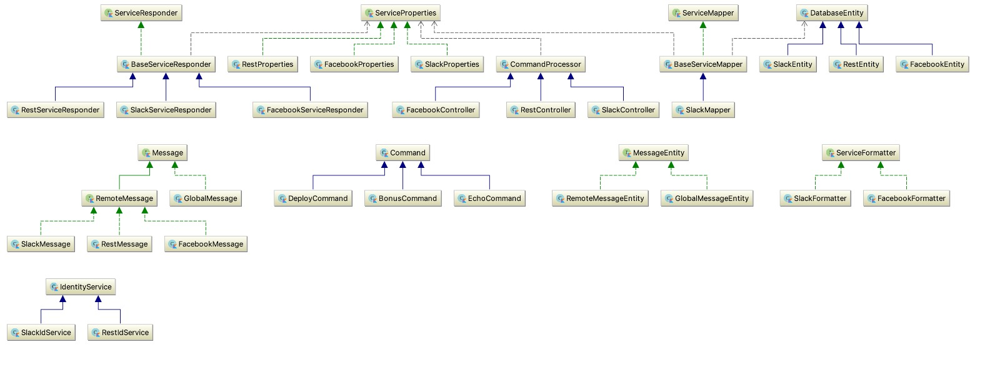

# Ontwerp

Door de ASD project methode is de applicatie gaande tijd veranderd. Dit is omdat de requirements vanuit de klant aanpasde. De eerste iteratie was alleen met Slack ondersteuning en directe communicatie met de Blockchain. Daarna kwam de vraag voor ondersteuning voor andere chat services; er was gekozen voor Facebook. Het moest wel zo opgezet worden dat het uitbreidbaar was voor eventueel andere chat services, dit was iteratie 2. Na deze realisatie heb ik feedback gevraagd aan mede collega's en kwam ik tot de conclusie om een micro service architectuur te implementeren. Dit is zodat elke chat service een aparte service + stack heeft (zelf gekozen programmeer taal en chat implementatie). Op deze manier is alles helemaal los van elkaar. De chat service implementaties weten niks van de blockchain, alleen van het `core` project. Hier zijn verschillende endpoints op om data op te halen of te versturen.

## Eerste iteratie

Dit was de eerste iteratie. Het was een `Controller` met een endpoint voor de Slack webhook. Deze functie riep dan functies aan op de Blockchain waardoor er problemen waren met de time-out's. Een van de randvoorwaardes van Slack is dat er binnen 3 seconde een reactie verstuurd moet worden. Deze reactie wordt dan naar de gene gestuurd die het commando heeft aangeroepen. Omdat de Blockchain langer doet over verwerken van data door de decentralized nature moet dit dus asynchroon opgelost worden. Dit voegde al snel veel complexiteit toe aan de applicatie. In deze iteratie was hier nog geen rekening mee gehouden.

## Tweede iteratie

Na de eerste iteratie had ik nieuwe inzichten. Er moet rekening gehouden worden met asynchrone code. Deze logica wil je niet in de `Controller`, ik heb dus een `Service` aangemaakt. Deze service heeft de logica voor het afhandelen van een chat service en de asynchrone code. Ook is er een abstractie laag toegevoegd. Een service moet een interface implementeren zodat het systeem er zeker van weet dat die dit kan afhandelen. Na deze iteratie werkende het systeem en was het uitbreidbaar, toch voelde het niet helemaal goed. Omdat de vraag kwam vanuit de `PO` om de commando's ook via een REST-interface te exposen moest er dus synchrone code in een asynchrone manier verwerkt worden. Dit begon te wringen en vroeg ik dus om feedback aan collega's.

## Derde iteratie

Na de feedback van collega's heb ik nog eens na zitten denken. De afspraken die ik nu had gemaakt die een service _moest_ implementeren waren vast. Elke andere manier zou dus niet ondersteund worden. Deze afspraken kan ik ook in het HTTP protocol vastleggen i.p.v. in Java Interfaces. Dit was dus de derde iteratie.

De applicatie bestaat nu uit 4 services.

- Core

  De core service is de enige die weet dat er uberhaupt sprake is van een blockchain. Deze heeft contact met het smart contract en kan informatie uit de blockchain halen. Deze is beveiligd met OAuth2. Je moet een `clientId` en `clientSecret` hebben die geregistreerd is om toegang te hebben. Ook heeft deze service als enige de private key voor de wallet die toegestaan is voor interactie met het smart contract.

- Web

  De web service is een tussen service tussen een web interface en het core project. Deze heeft dus een valide `clientId` en `clientSecret` om functies aan te roepen. Deze is ook OAuth beschermd en zal dus alleen ingelogde gebruikers toestaan. Deze gebruikers zullen geauthoriseerd worden via de Azure Active Directory.

- Slack

  Dit is een losstaand project van de rest. Deze is verantwoordelijk voor de integratie met Slack. Op het moment ondersteund die slash commando's en interactieve knoppen.

  Gebaseerd op input Slack worden er acties ondernomen. Bij een `/give` commando wordt er een bonus gegeven en zodra deze is gegeven wordt er een berichtje gestuurd naar de gebruiker dat het verwerkt is. Ook als de gebruiker op de interactieve knoppen klikt voor de vorige/volgende pagina van bonussen.

- Facebook

  Dit is een proof of concept service. Deze is om aan te tonen hoe een andere implementatie eruit ziet. Het laat zien hoe er omgegaan wordt met lokale user id's en hoe de core service aangeroepen wordt.

## IMG folder

### Architectuur-1

Dit is een class diagram van de architectuur. Hier zie je veel inheritence en daardoor was die zeer beperkt. Het SOLID principe kwam hier niet tot zijn recht, met name het _Single Responsiblity_ gedeelte niet.

### Architectuur-2

Hier kwam de _Single Responiblity_ al meer naar voren. Er is een aparte service die reageert (`ServiceResponder`) echter zie je nog steeds dat de `...CommandContext` nog steeds 2 interfaces implementeert. Inheritence is hier nog steeds erg prominent aanwezig.

### Architectuur-3

Dit is de architectuur de het beste de SOLID principes aanhoud. Alles heeft maar 1 parent en is daadwerkelijk verantwoordelijk voor 1 ding, _Single Responiblity_!
